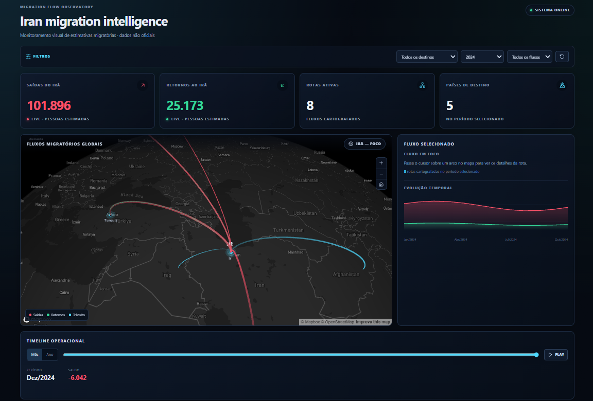
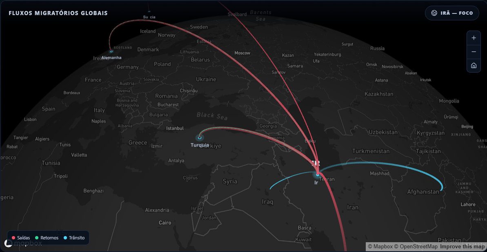
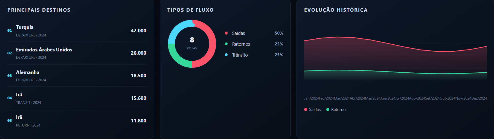

# Migration Flow Observatory

> Um painel interativo para visualização de fluxos migratórios, rotas e indicadores demográficos ao longo do tempo.

[](./LICENSE)


---

## ⚠️ Aviso importante

Este projeto tem **finalidade educacional e de demonstração técnica**. Ele **não é uma fonte oficial** de estatísticas migratórias. Os dados exibidos podem representar:

- estimativas baseadas em bases públicas disponíveis, quando existentes;
- dados simulados (*mock data*), quando não há API pública em tempo real acessível para determinado indicador.

Nenhuma informação apresentada deve ser utilizada como referência oficial, jornalística ou acadêmica sem verificação independente da fonte primária.

---

## Descrição

O **Migration Flow Observatory** é um dashboard interativo que visualiza fluxos migratórios — pessoas deixando um país, retornando, rotas percorridas e a evolução desses fluxos ao longo do tempo — através de mapas geoespaciais, animações de rotas e indicadores estatísticos.

O projeto nasceu como estudo de caso técnico, com foco inicial em fluxos migratórios relacionados ao Irã, mas com arquitetura pensada para suportar qualquer país ou região no futuro.

## Screenshots

| Dashboard | Mapa Interativo | Linha do Tempo |
|---|---|---|
|  |  |  |

## Objetivos

- Demonstrar na prática conhecimentos de desenvolvimento full-stack, bancos de dados geoespaciais e visualização de dados.
- Servir como portfólio profissional para processos seletivos internacionais.

## Motivação

A ideia para o Migration Flow Observatory surgiu enquanto eu acompanhava notícias sobre guerras e crises humanitárias e me deparei com uma pergunta simples: para onde vão os civis que precisam deixar suas casas para escapar de um conflito? Quais países recebem essas pessoas? Quais são os principais destinos? Esses fluxos mudam ao longo do tempo? E, depois de deixar seu país de origem, essas pessoas permanecem no destino ou eventualmente retornam? As notícias costumam mostrar números, histórias e acontecimentos isolados, mas nem sempre é fácil enxergar o movimento dessas populações em uma escala mais ampla. Foi a partir dessas perguntas que surgiu a ideia de criar o Migration Flow Observatory: uma aplicação capaz de transformar dados sobre migração em uma representação visual dos fluxos entre diferentes locais, facilitando a compreensão de origem, destino, rotas e intensidade dos movimentos migratórios. O objetivo não é apenas mostrar números, mas tornar esses movimentos mais fáceis de visualizar e explorar.

## Tecnologias

### Frontend
- React
- TypeScript
- Vite
- TailwindCSS
- Framer Motion
- Deck.gl
- Mapbox GL
- React Query
- Zustand

### Backend
- Node.js
- Express
- TypeScript

### Banco de Dados
- PostgreSQL
- PostGIS
- Prisma ORM

### Ferramentas
- ESLint
- Prettier
- Husky + lint-staged
- Git / GitHub
- Docker + Docker Compose

## Arquitetura

O projeto é dividido em três módulos principais — `frontend/`, `backend/` e `database/` — com responsabilidades separadas para facilitar a organização e evolução da aplicação.

## Estrutura das pastas

Estrutura completa e responsabilidade de cada diretório documentadas em [`docs/folder-structure.md`](./docs/folder-structure.md).

```
migration-flow-observatory/
├── backend/     # API Node.js + Express + TypeScript
├── frontend/    # React + TypeScript + Deck.gl/Mapbox
├── database/    # PostgreSQL + PostGIS + Prisma
├── docs/        # Documentação de arquitetura e decisões
├── docker/      # Orquestração de containers (futuro)
└── scripts/     # Scripts utilitários
```

## Instalação

```bash
git git clone https://github.com/yagotec420/migration-flow-observatory.git

# Variáveis de ambiente
cp .env.example .env                    # raiz — usado pelo docker-compose
cp backend/.env.example backend/.env
cp database/.env.example database/.env
# edite os três .env e defina uma senha real (mantenha-os sincronizados)

# Dependências
cd backend && npm install && cd ..
cd database && npm install && cd ..
cd frontend && npm install && cd ..
```

Configure também `frontend/.env` a partir de `frontend/.env.example`. `VITE_MAPBOX_TOKEN` habilita o estilo Mapbox; sem token, a aplicação usa base escura pública.

## Execução

```bash
# 1. Subir o banco (PostgreSQL + PostGIS)
docker compose up -d
docker compose logs -f postgres   # aguarde o healthcheck ficar "healthy"

# 2. Aplicar schema e popular dados de exemplo
cd database
npm run generate
npm run migrate:deploy   # ou: npm run migrate:apply-manual (sem o Prisma CLI)
npm run seed
cd ..

# 3. Rodar o backend
cd backend
npm run dev   # desenvolvimento, com reload automático
# ou: npm run build && npm start

# 4. Rodar o frontend (em outro terminal)
cd frontend
npm run dev
```

A API sobe em `http://localhost:3333` (Mock Data por padrão — ver `database/docs/integration-review.md` para como o Provider PostgreSQL, já implementado, pode ser ativado). Health check: `GET http://localhost:3333/health`. Endpoints completos em [`backend/docs/endpoints.md`](./backend/docs/endpoints.md).

## Funcionalidades

### Planejadas
- Mapa interativo com rotas migratórias animadas
- Dashboard com estatísticas e indicadores (entradas, saídas, saldo migratório)
- Linha do tempo com evolução histórica dos fluxos
- Filtros por período, rota e tipo de fluxo
- API pública para consulta de dados agregados
- Autenticação de usuários (para funcionalidades avançadas)

### Em desenvolvimento

- Integração e utilização de dados reais
- Refinamento da experiência visual e das interações do dashboard


### Concluídas
- ✅ Definição da arquitetura global
- ✅ Estrutura de pastas do repositório
- ✅ Documentação técnica inicial
- ✅ API REST completa (Countries, Routes, Flows, Statistics, Timeline, Counters, Dashboard) sobre Mock Data
- ✅ Modelagem PostgreSQL + PostGIS via Prisma, com migrations, seeds e `PostgresDataProvider` pronto para ativação
- ✅ Sistema de backup e restauração (banco + projeto completo)
- ✅ Frontend React integrado: dashboard, mapa Deck.gl/Mapbox, filtros, KPIs animados e timeline

## Roadmap

Roadmap completo em [`docs/roadmap.md`](./docs/roadmap.md):

- **v1** — Mapa, rotas e dashboard com dados simulados
- **v2** — Backend, banco de dados e API real
- **v3** — Dados reais, autenticação e filtros avançados
- **v4** — Deploy, monitoramento, performance e testes

## Backup e Recuperação

Backups regulares são essenciais neste projeto por dois motivos: permitir restaurar o ambiente de desenvolvimento em uma máquina nova sem perda de trabalho, e garantir que o histórico de dados (uma vez que dados reais substituam o Mock, ver `docs/roadmap.md` v3) nunca dependa de uma única cópia.

- **Banco de dados** — `database/backups/database/backup-database.sh` (gera um dump via `pg_dump`) e `restore-database.sh` (restaura via `pg_restore`, com confirmação explícita antes de sobrescrever dados).
- **Projeto completo** — `database/scripts/create-full-backup.sh` gera `migration-flow-complete-backup.zip` com todo o código e documentação, excluindo `node_modules/`, `dist/` e qualquer `.env` real.

Nenhum script contém credenciais — todas vêm de variáveis de ambiente. Guia completo de restauração passo a passo: [`BACKUP_RESTORE_GUIDE.md`](./BACKUP_RESTORE_GUIDE.md). Detalhes de cada script: [`database/backups/README.md`](./database/backups/README.md).

## Contexto do projeto

Para uma visão rápida de todas as decisões e do estado atual entre etapas, veja [`PROJECT_CONTEXT.md`](./PROJECT_CONTEXT.md).

## Licença

Distribuído sob a licença MIT. Veja [`LICENSE`](./LICENSE) para mais detalhes.

## Contribuição

Contribuições são bem-vindas! Para contribuir:

1. Faça um fork do repositório
2. Crie uma branch para sua feature (`git checkout -b feat/nome-da-feature`)
3. Siga os padrões de commit descritos em [`docs/coding-standards.md`](./docs/coding-standards.md)
4. Abra um Pull Request descrevendo a mudança

## Contato

>🔗 [LinkedIn](https://www.linkedin.com/in/yago-guilherme-7b09562b8/)  
💻 [GitHub](https://github.com/yagotec420/)  
📧 [E-mail](mailto:yagoguilherme0420@gmail.com)
